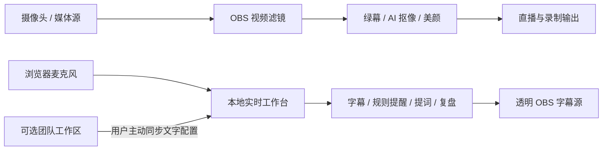

<div align="center">

# AI直播助手

**让 OBS 同时拥有专业画面处理、实时字幕和直播话术辅助。**

面向个人主播、品牌店播、MCN、培训直播与企业直播团队的开源 OBS 插件。

[**立即下载**](https://aithinks.cn/ai-live-assistant/) · [产品主页](https://aithinks.cn/ai-live-assistant/) · [快速上手](#5-分钟上手) · [开发文档](#开发与贡献)


</div>

> [!IMPORTANT]
> 当前提供的是 **Windows x64 / macOS Apple Silicon 未签名公开测试版**，不是已完成 Authenticode、Developer ID 与 Apple 公证的 production 版本。Windows SmartScreen 或 macOS Gatekeeper 可能显示安全提示，请只从[产品主页](https://aithinks.cn/ai-live-assistant/)下载并核对 SHA-256。

## 为什么做 AI直播助手

直播时，画面、字幕、提词和团队话术经常分散在多个工具里。AI直播助手把这些高频能力放回主播熟悉的 OBS 工作流：滤镜负责低延迟画面处理，本地 Sidecar 负责字幕与规则辅助，可选云端只同步团队主动维护的文字配置。

当模型、Sidecar、浏览器识别或网络不可用时，基础绿幕路径仍可继续工作，不让辅助能力成为直播链路的单点故障。



## 已经可以做什么

| 能力 | 你能获得什么 | 当前实现 |
|---|---|---|
| 绿幕抠像 | 自定义 Key 色、相似度、平滑、羽化、去绿边、发丝与服装边缘优化 | GPU Shader，低延迟基础路径 |
| AI 人像 / 混合抠像 | 无绿幕人像分离，或 AI matte 与绿幕去绿结合 | RVM 双场景档：通用/多人、单人商品/透明物 |
| AI 美颜 | 自然、标准、精致三档，可调磨皮、美白、锐化、瘦脸、大眼、红润与细节 | YuNet 人脸检测 + GPU Shader / heuristic |
| 场景预设 | 快速套用美妆、女装、课程参数，并可继续微调 | 版本化预设与旧场景迁移保护 |
| 实时字幕 | 浏览器语音识别、临时/最终字幕、字号与上下安全区、应急手工字幕 | 本地 Sidecar + SSE + 透明 OBS 浏览器源 |
| 规则提醒 | 根据本地风险词提示可能需要关注的表达，并说明命中依据 | 可解释的本地规则，不提供法律结论 |
| 提词辅助 | 依据商品简报、已授权最终字幕、卖点和规则生成候选话术 | `local-rules-v1`，不是 LLM；必须人工采用并再次确认 |
| 直播复盘 | 查看最终字幕与规则命中，导出 JSON，随时删除会话 | 默认内存保存，不上传字幕历史 |
| 团队协作 | 保存商品/主题、卖点、风险词和共享话术，多设备按需同步 | 可选账号配对与免费测试团队工作区 |
| 安全更新 | 校验不可变下载地址、签名元数据、文件大小与摘要，安装失败保留或恢复原版本 | Ed25519 更新清单 + SHA-512 载荷校验 |

### 适合这些直播场景

- **电商直播**：人像抠像、美颜、商品场景档、卖点覆盖与人工确认提词。
- **服装 / 美妆店播**：发丝和服装边缘优化、自然美颜、版本化场景预设。
- **课程与培训**：实时字幕、顶部/底部安全区、关键词提醒和会后文本复盘。
- **MCN 与品牌团队**：统一商品简报、规则词和共享话术，设备可配对、可撤销。
- **已有绿幕直播间**：继续使用稳定的 GPU 绿幕链路，同时按需开启 AI 能力。

## 5 分钟上手

### 1. 下载并安装

前往[产品主页](https://aithinks.cn/ai-live-assistant/)选择对应平台：

- Windows 10 / 11 x64：NSIS 安装器。
- macOS 12 或以上：Apple Silicon PKG。

当前公开版本、文件大小和摘要以根目录 [`VERSION`](VERSION) 与 canonical [`latest.json`](https://aithinks.cn/downloads/ai-live-assistant/latest.json) 为唯一事实源。README 不单独维护版本号。

### 2. 在 OBS 添加滤镜

1. 安装完成后重启 OBS。
2. 选中摄像头、媒体源、浏览器源或采集源。
3. 右键打开“滤镜”，点击 `+`。
4. 添加 `AI直播助手`。
5. 选择绿幕、AI 人像、混合或关闭抠像模式，再按需要开启美颜。

第一次使用可直接从“美妆 / 女装 / 课程”预设起步。需要精细调整时，再修改相似度、平滑度、边缘羽化、溢色抑制、发丝优化和背景融合。

### 3. 开启字幕与助手

从 OBS“工具”菜单或滤镜属性页打开新版控制面板，在“字幕”或“AI 助手”页点击“打开实时工作台”。

1. 阅读本次会话的麦克风与浏览器识别说明并明确同意。
2. 开始识别，或使用应急文本字幕。
3. 复制透明字幕地址，在 OBS 中添加一个 `1920 × 1080` 浏览器源。
4. 按需设置规则词、商品简报与提词内容。
5. 结束后导出复盘，或立即删除本机会话。

> 浏览器不支持 Speech Recognition 时，工作台会明确显示不可用，并保留手工字幕入口，不会伪造识别结果。

## 产品设计原则

### 直播稳定优先

- OBS 渲染回调不执行网络请求、磁盘 I/O、模型初始化或长时间等待。
- AI 推理只保留最新待处理帧，避免队列积压造成延迟不断增长。
- 模型缺失或失败时回退到基础绿幕；首个 AI 遮罩就绪前保留原画面。
- Sidecar 只在用户点击时启动，崩溃或断网不影响 OBS 基础视频能力。

### 隐私默认克制

- Sidecar 只监听 `127.0.0.1`，不会开放公网端口。
- Sidecar 不采集 OBS 音轨，也不把麦克风音频写入磁盘。
- 语音识别由当前浏览器提供，是否联网处理取决于浏览器实现；每次会话都需要用户明确同意。
- 云端同步是可选的，只同步用户主动填写的商品简报、规则词和共享话术，不上传音视频、OBS 画面、字幕历史、规则命中或复盘。
- 本地会话支持立即删除；设备可在网页撤销，撤销后下次同步会清理本机绑定。

### 建议必须由人决定

- 当前话术引擎是可解释的 `local-rules-v1`，不是 LLM。
- 所有候选话术先进入未确认草稿，必须由主播或场控采用并再次确认。
- 产品不会自动代主播发言或发布，也不把关键词命中包装成法律结论。

## 验证状态与已知边界

项目已经完成双平台安装包、更新安全链、约定真人音画同步、卷发 / 透明物 / 快速手部 / 低光 / 多人画质集、真实设备公网长稳和服务端回滚基线。双平台 720p / 1080p、30 / 60 FPS、绿幕 / AI 人像 / 混合模式的短时性能矩阵也已建立。

当前仍有这些边界：

- **尚未完成平台正式签名与公证**，所以不能称为签名 production。
- **macOS 当前发布包仅面向 Apple Silicon**；暂不提供 Intel Mac 与 Linux 安装包。
- **真人 ASR 主观质量仍需扩大验证**，准确率和延迟受浏览器、网络、口音、麦克风与环境噪声影响。
- **精致美颜几何只承诺单个主检测脸**，不承诺同时精细处理多张脸。
- **固定样本与现有设备通过不代表所有硬件和直播环境**，仍需全新设备安装、更多 Windows 硬件和多人长期试用。
- 当前没有本地 Whisper、LLM 自动生成、支付、自动续费、多直播间实时质检或自动代播。

详细证据和最新发布判断请查看[项目状态](docs/PROJECT_STATUS.zh-CN.md)与[生产发布检查表](docs/RELEASE_CHECKLIST.zh-CN.md)。编译或自动测试通过不等同于真实直播场景验收通过。

## 更新与发布包

从 1.4.1 起的客户端可在用户确认且没有直播、录制、回放缓冲或虚拟摄像头输出时安装后续更新。更新元数据使用 Ed25519 签名，安装载荷会核对精确大小与 SHA-512；这些保护不替代操作系统平台签名。

公开与本地构建产物遵循统一命名：

```text
ai-live-assistant-windows-x64-<version>.exe
ai-live-assistant-windows-x64-<version>.zip
ai-live-assistant-macos-arm64-<version>.pkg
ai-live-assistant-macos-arm64-<version>.zip
ai-live-assistant-source-<version>.tar.gz
```

> Windows 1.4.0 的更新调度存在已修复缺陷，需要先手动安装 1.4.1 或更高版本一次；1.3.x 客户端也需要先手动升级。

## 开发与贡献

项目使用 C11、Objective-C++、Go、OBS/libobs、ONNX Runtime 与 GPU Shader。当前固定工程基线为 OBS Studio 32.1.2；macOS UI 使用 AppKit，Windows UI 使用 Win32。

先运行统一检查：

```sh
./scripts/test-all.sh
```

macOS 快速 Shader / 基础插件构建：

```sh
./scripts/build-macos.sh
```

> 此快速构建关闭 ONNX，只适合检查 C / Shader 和基础插件加载，不能代表 AI 人像或美颜通过。

Windows 开发打包（Visual Studio 2022 x64 PowerShell）：

```powershell
Set-ExecutionPolicy -Scope Process Bypass
.\scripts\package-windows.ps1
```

涉及 ONNX、发布包或生产流程时，请按[开发指南](docs/DEVELOPMENT_GUIDE.zh-CN.md)执行完整构建与验证，不要把本地开发包直接当成公开发布物。

欢迎提交 Issue 和 Pull Request。修改前请先阅读 [`AGENTS.md`](AGENTS.md)，并特别注意持久化设置、枚举值、Shader uniform、模型 I/O 和更新清单都是兼容性契约。

### 核心文档

- [项目状态与已知风险](docs/PROJECT_STATUS.zh-CN.md)
- [执行路线图](docs/ROADMAP.zh-CN.md)
- [工程契约](docs/CONTRACTS.zh-CN.md)
- [模型选型与许可证据](docs/MODEL_SELECTION.zh-CN.md)
- [Sidecar、实时字幕与 AI 助手 RFC](docs/SIDECAR_RFC.zh-CN.md)
- [开发指南](docs/DEVELOPMENT_GUIDE.zh-CN.md)
- [生产发布流程](docs/PRODUCTION_RELEASE.zh-CN.md)
- [文档索引](docs/INDEX.zh-CN.md)

## 开源许可

项目代码采用 [GPL-2.0-or-later](LICENSE)。包含 Robust Video Matting 模型的组合二进制按 GPL-3.0 兼容条款分发，并随包提供对应源码、许可证和模型 notice；完整说明见 [`data/licenses/THIRD_PARTY_MODELS.md`](data/licenses/THIRD_PARTY_MODELS.md)。

## 联系与支持

- 产品与下载：[aithinks.cn/ai-live-assistant](https://aithinks.cn/ai-live-assistant/)
- 免费测试控制台：[aithinks.cn/ai-live-assistant/app](https://aithinks.cn/ai-live-assistant/app/)
- 问题反馈：[GitHub Issues](https://github.com/mason-home/ai-live-assistant/issues)
- 商务合作：[business@aithinks.cn](mailto:business@aithinks.cn)

## English summary

AI Live Assistant is an open-source OBS plugin for streamers and live-commerce teams. It combines green-screen keying, RVM portrait matting, beauty enhancement, browser-powered live captions, local rule-based reminders, human-approved prompting, text replay, and optional team workspace sync.

The current Windows x64 and macOS Apple Silicon downloads are **unsigned public beta builds**, not platform-signed production releases. Speech recognition is provided by the user's browser and may use an online service. The assistant is not an LLM, never speaks or publishes automatically, and its failure does not disable the basic OBS video path.

---

如果这个项目对你的直播工作流有帮助，欢迎点一个 Star，也欢迎带着真实场景反馈回来。
